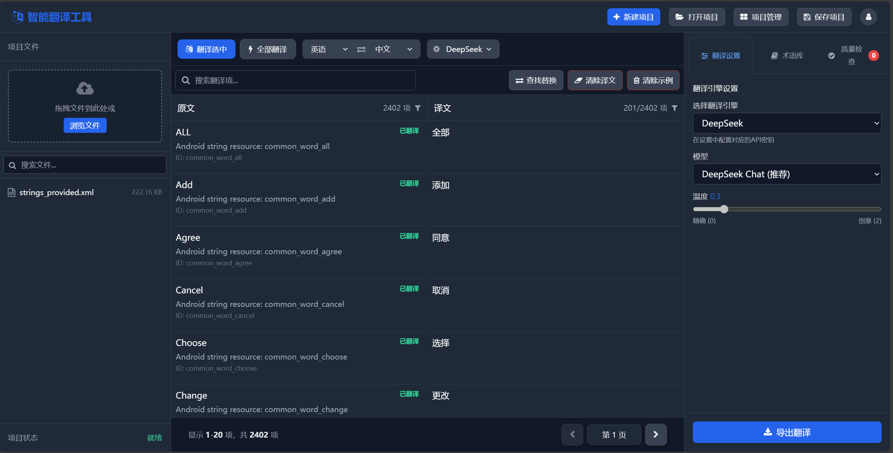
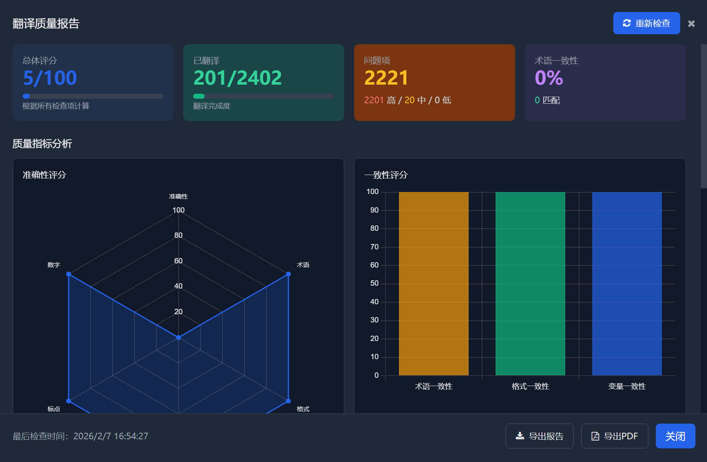
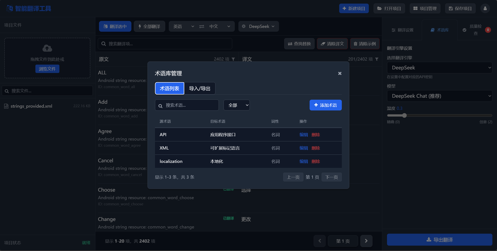
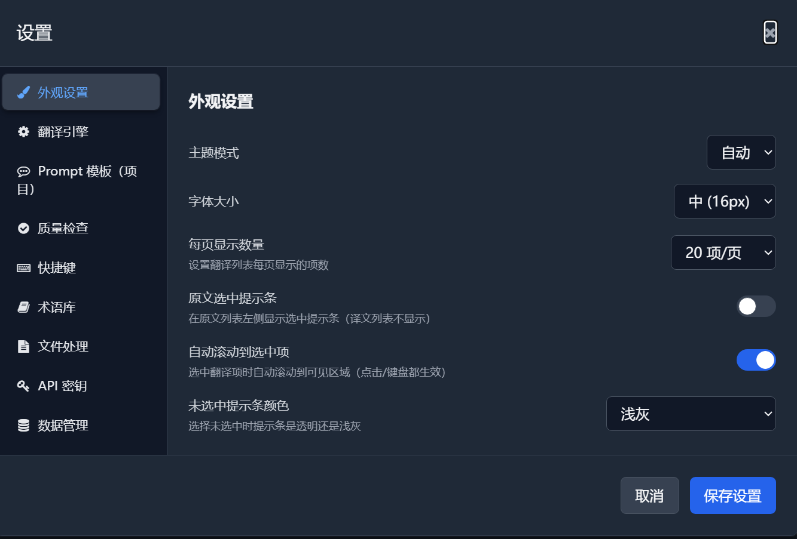
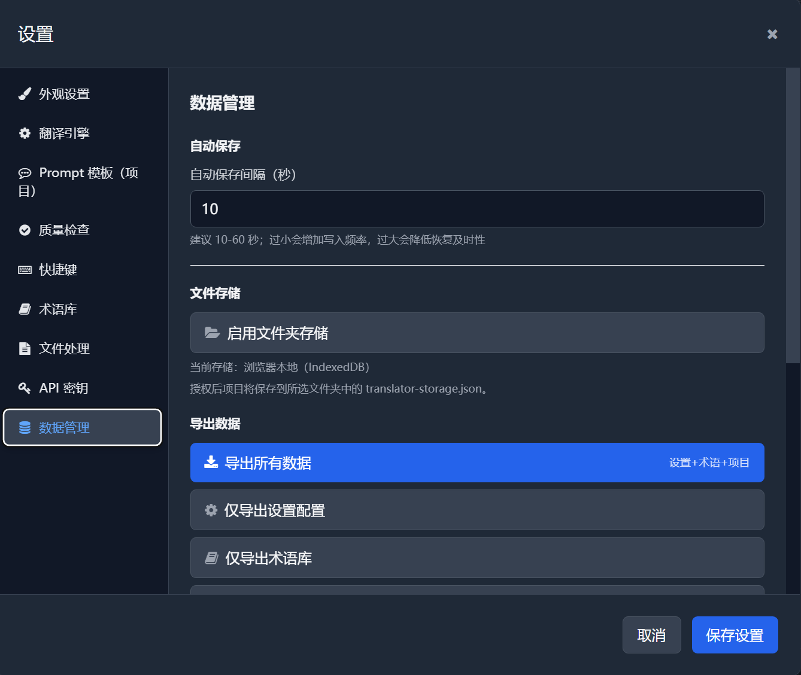

# 智能翻译工具 - 多格式本地化翻译助手

一个功能强大的本地化翻译工具，支持多种文件格式的翻译和管理。

**仓库**：[https://github.com/webmturn/ai-localization](https://github.com/webmturn/ai-localization)  
**当前版本**：v1.1.0 | [发布说明](docs/RELEASE-v1.1.0.md) | [桌面测试版下载](https://github.com/webmturn/ai-localization/releases/tag/v1.1.0)

## ✨ 特性

- 📝 支持多种文件格式（JSON, XLIFF, PO, Excel 等）
- 🎨 现代化的用户界面（Tailwind CSS）
- 📱 移动端自适应布局（底部工具栏、手势操作、模态框适配）
- 🌙 深色模式支持
- 💾 本地存储，无需服务器
- 📊 翻译质量报告
- 🔍 术语库管理
- 📈 翻译进度跟踪
- 🧠 上下文感知翻译（前后相邻条目语境参考）
- 💬 多轮会话记忆（跨批次保持翻译风格一致）
- 🎯 Priming 样本（让模型先理解文件命名风格）
- 🔑 Key/字段名上下文（辅助 key-value 结构翻译）
- ⏸️ 批量翻译暂停/取消/重试
- 🗄️ 翻译请求缓存（减少重复 API 调用）

## � 截图预览

### 主界面 — 翻译列表 + DeepSeek 引擎


### 翻译质量报告


<details>
<summary>更多截图</summary>

### 术语库管理


### 设置 — 外观


### 设置 — 数据管理


</details>

## �🚀 快速开始

> **⚠️ 首次使用必读**：必须先执行 `npm install` 和 `npm run build-css`，否则打开页面将无样式。`public/styles.css` 由构建生成，未提交到仓库。

### 前置要求

- Node.js (v18 或更高版本)
- npm 或 yarn

### 安装步骤

1. **安装 Node.js**（如果还没有）
   - 查看 [安装指南](docs/NodeJS-Install-Guide.md)

2. **安装依赖**
   ```bash
   npm install
   ```

3. **构建 CSS**
   ```bash
   npm run build-css
   ```

4. **打开应用**
   - 在浏览器中打开 `public/index.html`

## 📁 项目结构

详细的项目结构说明请查看 [项目结构文档](docs/PROJECT-STRUCTURE.md)

```
html/
├── config/          # 配置文件
├── docs/            # 文档
├── scripts/         # 脚本
├── src/             # 源代码
├── public/          # 发布目录（浏览器打开/部署）
│   ├── lib/         # 第三方库（本地化）
│   ├── index.html   # 主 HTML 文件
│   ├── app.js       # 应用入口（按顺序加载 public/app/**）
│   ├── app/         # 应用核心逻辑（模块化代码）
│   └── styles.css   # 构建后的 CSS
```

## 🛠️ 开发

### 监听 CSS 变化（开发模式）

```bash
npm run watch-css
```

### 构建生产版本

```bash
npm run build-css
```

## 📦 更新第三方库

### 检查最新版本

```bash
npm run check-versions
```

### 自动更新到最新版本

```bash
npm run auto-update
```

### 手动更新（使用当前配置）

```bash
npm run update-cdn
```

详细说明请查看 [CDN 更新指南](docs/README-CDN-UPDATE.md)

## 📚 文档

### 必读入口
- [快速开始](docs/QUICK-START.md)
- [文档索引（全部文档）](docs/INDEX.md)
- [Node.js 安装指南](docs/NodeJS-Install-Guide.md)
- [CDN 更新指南](docs/README-CDN-UPDATE.md)
- [Tailwind CSS 指南](docs/README-TAILWIND.md)
- [项目结构](docs/PROJECT-STRUCTURE.md)
- [API 参考](docs/API-REFERENCE.md)

## 🎯 主要功能

- **文件导入**: 支持拖放或选择文件导入
- **翻译管理**: 可视化的翻译项管理
- **术语库**: 自定义术语库，提高翻译一致性
- **导出功能**: 支持多种格式导出
- **搜索功能**: 快速搜索翻译项
- **分页显示**: 大量数据的分页管理
- **查找替换**: 批量修改翻译内容
- **翻译质量检查**: 占位符、术语、标点等自动检查

### 🧠 DeepSeek 翻译增强

| 功能 | 说明 |
|------|------|
| **上下文感知翻译** | 自动附带前后相邻条目，帮助 AI 理解语境 |
| **多轮会话记忆** | 跨批次共享上下文，保持翻译风格一致 |
| **Priming 样本** | 手选少量样本让模型理解文件命名风格 |
| **Key/字段名参考** | 翻译时参考 key 名称辅助判断语义 |
| **术语库匹配** | 翻译时自动匹配术语库，优先使用指定译名 |
| **请求缓存** | 相同请求复用结果，可配置 TTL |
| **批量分块** | 自动分块，支持自定义 items/chars 上限 |

### 📱 移动端优化

| 功能 | 说明 |
|------|------|
| **精简顶栏** | 次要操作收入"更多"菜单，保持顶栏干净 |
| **底部工具栏** | 文件、翻译、全选、设置四个快捷入口 |
| **底部 Sheet 侧边栏** | 侧边栏从底部滑入，带遮罩层和手势关闭 |
| **紧凑翻译卡片** | 自适应 textarea、更小间距和字号 |
| **模态框适配** | 设置/质量报告/术语库/帮助等模态框全面适配移动端 |
| **手势支持** | 左右滑动开关侧边栏、长按多选翻译项 |

## 🔑 API Key 配置说明

- 当你在设置中选择 **OpenAI / DeepSeek / Google** 等在线翻译引擎时，需要先配置对应的 API Key。
- **严格模式行为**：如果所选引擎缺少 API Key（或 Key 格式不正确），批量翻译会立即中止并给出一次提示。
- **安全提示**：请勿在 Issue、Pull Request 或公开场合粘贴真实的 API Key。

## 🔧 技术栈

- **前端框架**: 原生 JavaScript (现代化架构系统)
- **样式框架**: Tailwind CSS (本地构建)
- **图标库**: Font Awesome 4.7.0 (本地化)
- **图表库**: Chart.js 4.5.1 (本地化)
- **Excel 处理**: SheetJS 0.20.1 (本地化)

### 🏗️ 架构组件
- **命名空间管理**: 防止全局变量污染
- **依赖注入系统**: 松耦合的服务管理
- **模块管理器**: 自动依赖解析和加载
- **DOM缓存系统**: `DOMCache` 缓存 DOM 元素，减少重复查询
- **设置缓存系统**: `SettingsCache` 缓存 localStorage 设置
- **DOM优化管理器**: 批量DOM操作和虚拟滚动
- **错误管理系统**: 统一的错误处理和恢复
- **日志分级系统**: 按类别和级别过滤日志输出

## 📝 许可证

MIT

## 🤝 贡献

欢迎提交 Issue 和 Pull Request！

贡献指南请查看 [CONTRIBUTING.md](CONTRIBUTING.md)

## 📞 支持

如有问题，请查看文档或提交 Issue。
