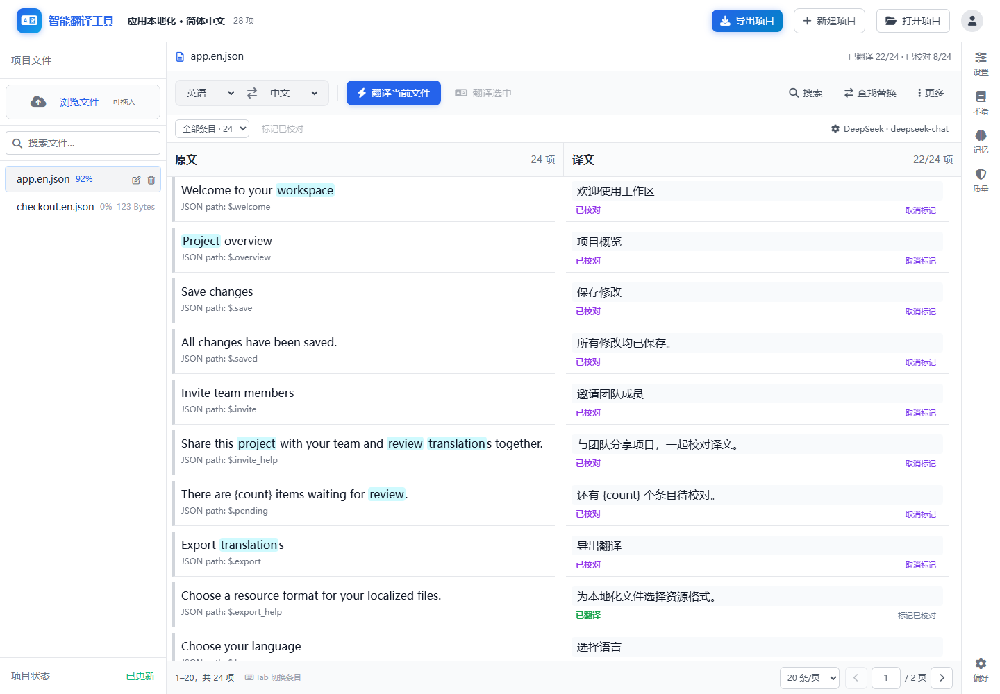
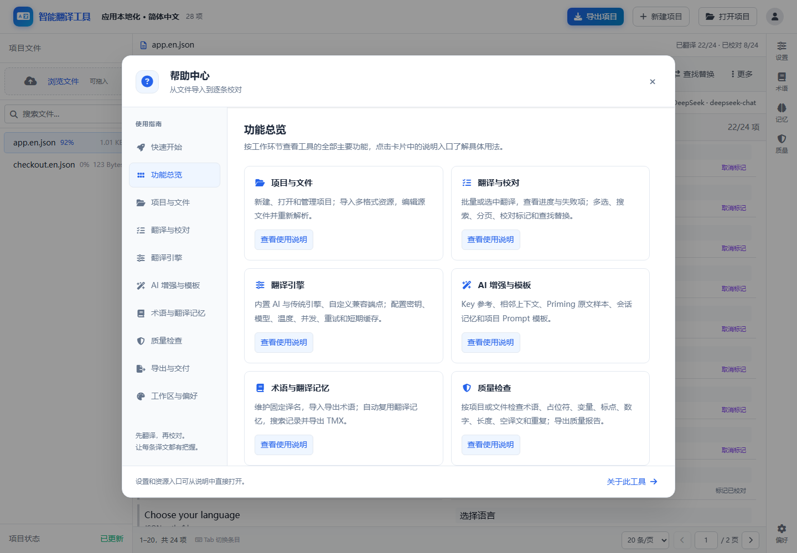
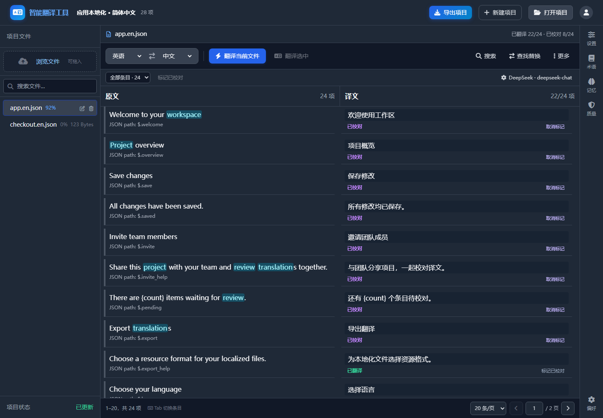
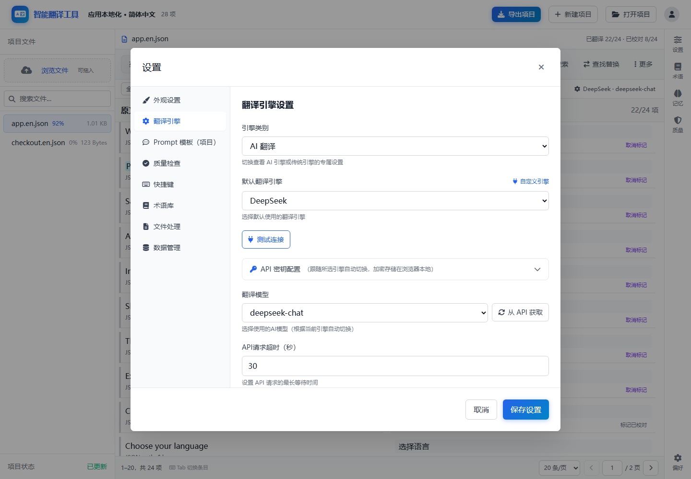
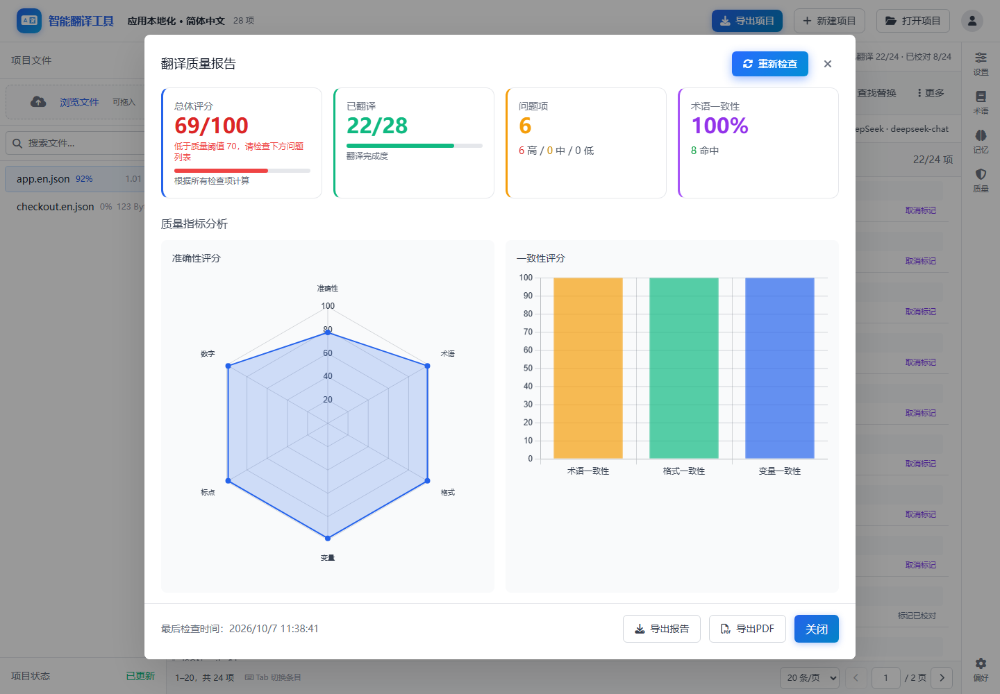
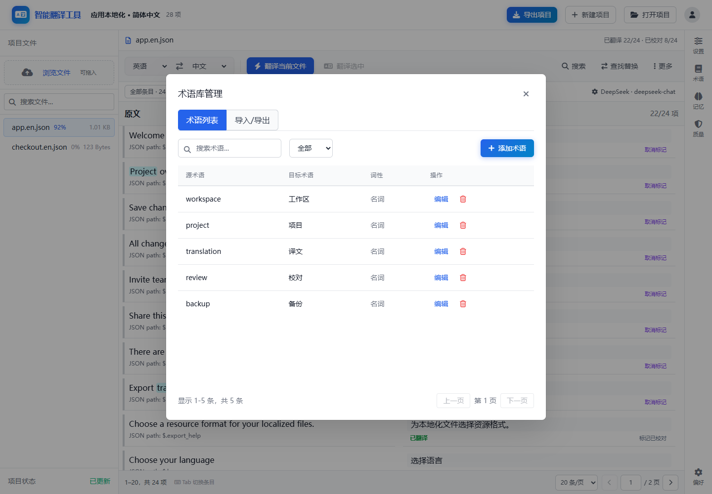
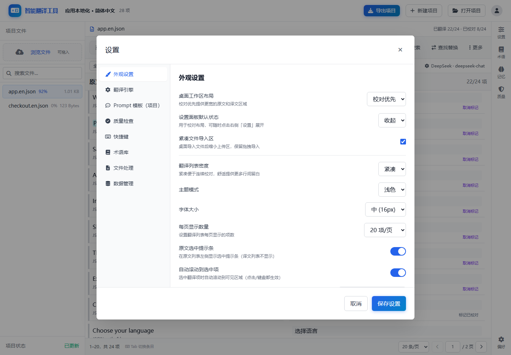
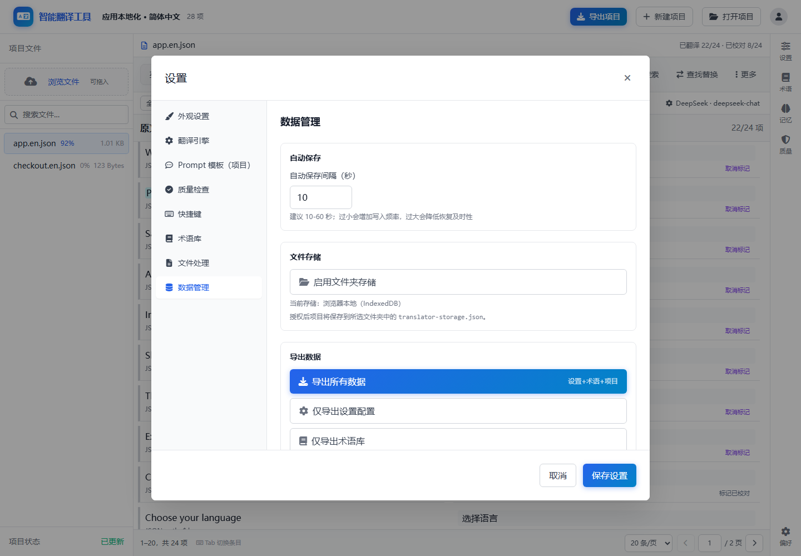
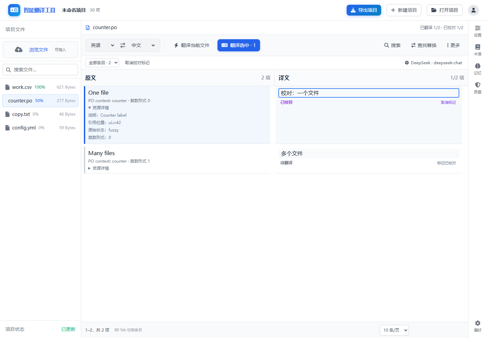
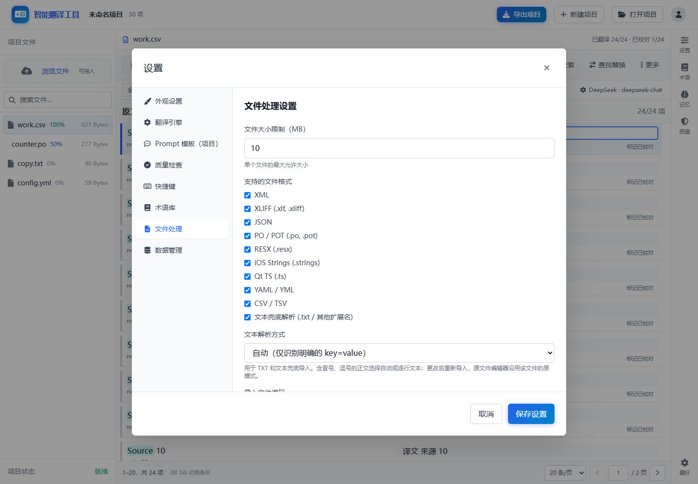

# 智能翻译工具 · AI Localization

面向本地化资源的 AI 翻译与校对工作台。把文件导入、批量翻译、逐条校对、术语与翻译记忆、质量检查和导出放在同一个工作区，适合处理应用文案与多语言资源文件。

AI-assisted workspace for translating, reviewing and exporting localization resources.

**仓库**：[https://github.com/webmturn/ai-localization](https://github.com/webmturn/ai-localization)  
**当前版本**：v1.4.1 | [版本说明](docs/RELEASE-v1.4.1.md) | [下载与发布](https://github.com/webmturn/ai-localization/releases) | [更新日志](CHANGELOG.md)

**常用流程**：打开文件 → 配置引擎 → 批量翻译 → 逐条校对 → 质量检查 → 导出交付。

项目与设置默认保存在本地。使用在线引擎时，原文及启用的上下文会发送到所选服务；也可接入本地的 OpenAI 兼容服务。

## ✨ 特性

- **校对工作区**：校对优先与经典三栏可切换，支持面板默认状态、列表密度、主题和字体设置。
- **翻译与校对**：当前文件或选中条目翻译，待翻译 / 待校对 / 已校对筛选，连续编辑、分页和批量查找替换。
- **多格式资源**：JSON、XML、Android strings.xml、XLIFF、YAML / YML、CSV / TSV、PO / POT、RESX、iOS Strings、Qt TS 和文本；显示资源身份、复数形态与原始状态。
- **内置与自定义引擎**：DeepSeek、OpenAI、Gemini、Claude、Google 翻译，以及 OpenAI 兼容端点；支持模型获取和连接测试。
- **AI 语境增强**：相邻上下文、Key 参考、Priming 原文样本、多轮会话记忆和项目 Prompt 模板。
- **术语与翻译记忆**：统一固定译名，自动复用精确匹配，管理记忆记录并导出 TMX。
- **质量检查**：按项目或文件检查术语、占位符、变量、数字、标点、长度、空译文与重复，定位问题并导出报告。
- **项目与交付**：多项目管理，编辑源文件后重新解析，按原资源格式或通用格式导出；项目 JSON 与数据备份携带原始文件，保留当前编辑，便于恢复后继续校对和导出。
- **请求控制**：暂停、继续、取消、失败重试、进度日志和预计时间；可配置并发、超时和短期缓存。
- **帮助与移动端**：13 个帮助栏目、61 条说明及当前快捷键；手机主题导航、底部工具栏、抽屉与深色模式。

## 📸 截图预览

以下截图来自 v1.4.1 当前界面，使用虚构的应用文案演示数据。

### 桌面工作区 — 文件、翻译与逐条校对


### 帮助中心 — 功能总览与说明入口


<details>
<summary>查看深色模式、引擎设置、质量报告、术语与手机界面</summary>

### 深色工作区


### 翻译引擎 — 内置服务与自定义入口


### 翻译质量报告


### 术语库管理


### 设置 — 外观


### 设置 — 数据管理


### 复数资源 — 注释、引用与原始状态


### 文件解析 — 编码与文本模式


### 手机工作区


</details>

## 🚀 快速开始

从源码运行前，请先执行 `npm ci` 和 `npm run build`。`public/styles.css` 和 `public/app.bundle.js` 是构建产物，未提交到源码仓库。发布页中的网页压缩包已包含构建产物，解压后可打开 `public/index.html`。

### 前置要求

- Node.js 20.19+、22.12+ 或 24+（建议使用当前受支持的 LTS 版本）
- npm 或 yarn

### 安装步骤

1. **安装 Node.js**（如果还没有）
   - 查看 [安装指南](docs/NodeJS-Install-Guide.md)

2. **安装依赖**
   ```bash
   npm ci
   ```

3. **构建（CSS + JS Bundle）**
   ```bash
   npm run build
   ```
   或分别构建：
   ```bash
   npm run build-css      # 构建 Tailwind CSS
   npm run build-bundle   # 将应用脚本合并为 1 个 bundle
   ```

4. **打开应用**
   - 在浏览器中打开 `public/index.html`
   - 如果存在 `app.bundle.js` 则自动加载（快），否则回退到 `app.js` 逐个加载（慢）

## 📁 项目结构

详细的项目结构说明请查看 [项目结构文档](docs/PROJECT-STRUCTURE.md)

```
html/
├── config/          # 配置文件
├── docs/            # 文档
├── scripts/         # 脚本
├── src/             # 源代码
├── public/          # 发布目录（浏览器打开/部署）
│   ├── lib/         # 第三方库（本地化）
│   ├── index.html   # 主 HTML 文件
│   ├── app.js       # 开发模式入口（按顺序加载模块）
│   ├── app.bundle.js # 生产 bundle（构建生成，1 个文件）
│   ├── app/         # 应用核心逻辑（模块化代码）
│   └── styles.css   # 构建后的 CSS
```

## 🛠️ 开发

### 监听 CSS 变化（开发模式）

```bash
npm run watch-css
```

### 运行测试与架构守护

```bash
npm test                # 全量单元与契约测试（Vitest）
npm run check-state     # 状态所有权静态检查（AppState 切片写入守护）
npm run check-globals   # 全局函数冻结检查（基线化 window 挂载）
```

### 构建生产版本

```bash
npm run build           # CSS + JS Bundle
npm run build-bundle    # 仅 JS Bundle
npm run build-css       # 仅 CSS
```

## 📦 更新第三方库

### 检查最新版本

```bash
npm run check-versions
```

### 自动更新到最新版本

```bash
npm run auto-update
```

### 手动更新（使用当前配置）

```bash
npm run update-cdn
```

详细说明请查看 [CDN 更新指南](docs/README-CDN-UPDATE.md)

## 📚 文档

### 必读入口
- [v1.4.1 发布说明](docs/RELEASE-v1.4.1.md)
- [快速开始](docs/QUICK-START.md)
- [文档索引（全部文档）](docs/INDEX.md)
- [更新日志](CHANGELOG.md)
- [Node.js 安装指南](docs/NodeJS-Install-Guide.md)
- [CDN 更新指南](docs/README-CDN-UPDATE.md)
- [Tailwind CSS 指南](docs/README-TAILWIND.md)
- [项目结构](docs/PROJECT-STRUCTURE.md)
- [API 参考](docs/API-REFERENCE.md)

## 🎯 主要功能

- **文件导入**: 支持拖放或选择文件导入
- **翻译管理**: 可视化的翻译项管理
- **逐条校对**: 按状态筛选条目，修改译文后确认校对标记
- **源文件编辑**: 文件树内编辑原始文件，重解析后自动保留既有译文
- **术语库**: 自定义术语库，提高翻译一致性
- **翻译记忆**: 精确命中复用译文，支持记录查询和 TMX 导出
- **导出功能**: 按原格式回写译文，支持部分条目导出；单文件失败显示原因并继续处理其他文件
- **搜索功能**: 快速搜索翻译项并跳转定位（跨页自动翻页）
- **分页显示**: 大量数据的分页管理
- **查找替换**: 批量修改翻译内容
- **翻译质量检查**: 占位符、术语、标点等自动检查（项目级/单文件级范围可选）

### 📄 资源解析与原格式导出

| 格式 | 解析与校对 | 原格式导出 |
|------|------------|------------|
| JSON | 嵌套对象、数组和根字符串；使用真实路径区分资源 | 按原路径回写选中译文，保留其他数据 |
| CSV / TSV | 自动识别常见表头或无表头数据，优先使用 source / original 列 | 按行列定位，保留额外列、未选中内容与行尾；字段引号写法可能规范化 |
| YAML / YML | 多文档、数组、别名及字符串路径；循环引用明确报错 | 保留非文本值、文档结构和未选中内容；重新生成文本，不保留原注释、缩进及锚点写法 |
| PO / POT、Qt TS | 已存在的复数形态分别校对，查看注释与 fuzzy / unfinished 等状态 | 按复数形态回写，保留其他形态 |
| Android XML、RESX | 区分字符串、数组与复数；过滤禁译和非文本资源 | 按对应资源回写译文 |
| XLIFF、通用 XML | 分段身份、内联标签、CDATA、短文本及常见可翻译属性 | 按分段或节点路径定位，支持同文异译 |
| iOS Strings | 资源键、字符串及 Unicode 转义；损坏引号明确报错 | 按资源键回写译文 |
| TXT 与文本兜底 | 自动、逐行文本、简单键值三种模式；文件记住导入时的模式 | 保留原文件名、未选中行、分隔符、缩进、BOM 与行尾 |

「偏好 → 文件处理」可设置编码、大小限制、格式开关与文本解析模式。已知格式解析失败会显示诊断，保留同名文件的既有内容与译文；旧编码自动识别有歧义时，可手动指定编码。

文本默认自动模式仅识别明确的 `key=value`，正文中的冒号、逗号和 URL 保留整行。简单键值模式还可使用冒号、Tab、逗号与续行，反斜杠转义按字面保留，不实现完整 INI / Java properties 语义。选中的键值续行导出时合并为一行，键值译文中的实际换行需先改为单行。资源下载使用 UTF-8，不恢复源文件的旧字节编码。

项目 JSON 和「偏好 → 数据管理」备份包含原始文件及当前编辑；读取原文或项目失败时停止备份并显示原因，避免导出不完整的备份。恢复旧项目时，未保存的原始文件仍需重新导入。资源导入不包含 Excel、Word 或 PDF 的专用解析器。

### 🔄 多引擎翻译

| 引擎 | 类型 | 批量翻译 | 备注 |
|------|------|----------|------|
| **DeepSeek** | AI | ✅ JSON 模式 | 默认引擎，可配置模型 |
| **OpenAI** | AI | ✅ JSON 模式 | 支持从 API 获取模型列表 |
| **Gemini** | AI | ✅ JSON 模式 | 原生 Gemini API，带请求限速 |
| **Claude** | AI | ✅ 原生 API | Anthropic Messages API 适配 |
| **Google 翻译** | 传统 | ❌ 逐条 | 需 API Key |
| **自定义引擎** | AI | ✅ 兼容接口 | OpenAI 兼容端点，可接入本地服务 |

引擎、密钥、模型和请求参数位于「偏好 → 翻译引擎」。自定义服务可从该页面直接管理。完整设置中的修改在点击「保存设置」后生效。

术语库支持 CSV / JSON 导入和 Excel 等格式导出；翻译资源导入不包含 `.xlsx`。翻译记忆库当前支持 TMX 导出，没有 TMX 导入入口。

### 🧠 AI 翻译增强

| 功能 | 说明 |
|------|------|
| **上下文感知翻译** | 自动附带前后相邻条目，帮助 AI 理解语境 |
| **多轮会话记忆** | 跨批次共享上下文，保持翻译风格一致 |
| **Priming 样本** | 手选少量样本让模型理解文件命名风格 |
| **Key/字段名参考** | 翻译时参考 key 名称辅助判断语义 |
| **术语库匹配** | 翻译时自动匹配术语库，优先使用指定译名 |
| **请求缓存** | 相同请求复用结果，可配置 TTL |
| **翻译记忆** | 相同原文与语言对的精确命中直接复用，跳过 API 请求 |
| **项目 Prompt 模板** | 按项目设置 System Prompt 和单条 / 批量覆盖模板 |
| **批量分块** | 自动分块，支持自定义 items/chars 上限 |

### 📱 移动端优化

| 功能 | 说明 |
|------|------|
| **精简顶栏** | 次要操作收入"更多"菜单，保持顶栏干净 |
| **底部工具栏** | 文件、翻译、全选、设置四个快捷入口，44px 触控目标 |
| **底部 Sheet 侧边栏** | 侧边栏从底部滑入，带遮罩层和手势关闭 |
| **下滑手势关闭** | 侧边栏 Sheet 支持下滑手势关闭 |
| **紧凑翻译卡片** | 自适应 textarea、更小间距和字号 |
| **模态框适配** | 设置/质量报告/术语库/帮助等模态框全面适配移动端 |
| **安全区域** | 底部工具栏、模态框、通知适配 iPhone X+ safe-area |
| **手势支持** | 左右滑动开关侧边栏、下滑关闭 Sheet、长按多选翻译项 |

## 🔑 API Key 配置说明

- 当你在设置中选择 **OpenAI / DeepSeek / Google** 等在线翻译引擎时，需要先配置对应的 API Key。
- **严格模式行为**：如果所选引擎缺少 API Key（或 Key 格式不正确），批量翻译会立即中止并给出一次提示。
- **安全提示**：请勿在 Issue、Pull Request 或公开场合粘贴真实的 API Key。

## 🔧 技术栈

- **前端框架**: 原生 JavaScript (现代化架构系统)
- **样式框架**: Tailwind CSS (本地构建)
- **图标库**: Font Awesome 6.7.2 (本地化)
- **图表库**: Chart.js 4.5.1 (本地化)
- **Excel 处理**: SheetJS 0.20.1 (本地化)
- **构建工具**: Node.js 脚本 (CSS: Tailwind CLI, JS: 自定义 bundle)

### 🏗️ 架构组件
- **状态所有权体系**: `AppState` 全部切片均有唯一 Owner Store，意图式 API 写入 + CI 静态守护
  - `ProjectStore`（项目/文件元数据）
  - `TerminologyStore`（术语库，唯一运行时数据源）
  - `TranslationViewStore`（翻译视图态：选中/过滤/分页）
  - `BatchProgressStore`（批量进度态与用户取消协议）
- **解析器注册表**: `ParserRegistry` 按格式注册/分发解析器，新增格式无需改动调度代码（OCP）
- **命名空间管理**: 防止全局变量污染
- **依赖注入系统**: 松耦合的服务管理
- **模块管理器**: 自动依赖解析和加载
- **DOM缓存系统**: `DOMCache` 缓存 DOM 元素，减少重复查询
- **设置缓存系统**: `SettingsCache` 缓存 localStorage 设置
- **DOM优化管理器**: 批量DOM操作和虚拟滚动
- **错误管理系统**: 统一的错误处理和恢复
- **日志分级系统**: 按类别和级别过滤日志输出

## 📝 许可证

MIT

## 🤝 贡献

欢迎提交 Issue 和 Pull Request！

贡献指南请查看 [CONTRIBUTING.md](CONTRIBUTING.md)

## 📞 支持

如有问题，请查看文档或提交 Issue。
