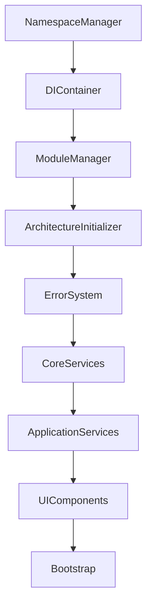

# 代码架构问题修复报告

## 修复概述

本次修复解决了项目中的代码架构问题，实现了模块化、命名空间隔离和依赖管理的完整解决方案。

## 主要问题及修复

### 1. 全局变量污染问题

#### 问题描述
- 大量全局变量直接挂载到window对象
- 没有命名空间隔离，容易产生命名冲突
- 难以追踪变量来源和依赖关系

#### 修复方案
创建了**命名空间管理系统** (`namespace-manager.js`)：

```javascript
// 修复前：全局变量污染
window.errorManager = new ErrorManager();
window.translationService = new TranslationService();
window.storageManager = new StorageManager();

// 修复后：命名空间隔离（新增组织结构，同时保持原有全局变量不被强制覆盖）
window.App = {
  core: {
    errorManager: errorManager
  },
  services: {
    translation: translationService,
    storage: storageManager
  }
};

// 推荐：通过 getService(...) 获取（未注册时返回 null）
const errorManager = getService('errorManager');
```

#### 核心功能
- **自动命名空间创建**：标准化的命名空间结构
- **全局变量监控**：检测和警告不当的全局变量使用
- **安全的全局变量创建**：提供受控的全局变量注册机制
- **命名空间保护**：防止意外覆盖重要的命名空间

### 2. 模块加载顺序依赖不清晰

#### 问题描述
- 脚本加载顺序隐式依赖，难以维护
- 没有明确的依赖声明
- 加载失败时缺少错误处理和重试机制

#### 修复方案
创建了**模块管理系统** (`module-manager.js`)：

```javascript
// 修复前：隐式依赖
var scripts = [
  "app/core/error-manager.js",  // 必须在其他模块之前？
  "app/core/error-utils.js",    // 依赖error-manager？
  "app/services/storage.js"     // 依赖关系不明确
];

// 修复后：显式依赖声明
moduleManager.registerModule('errorManager', {
  dependencies: [],
  factory: () => new ErrorManager()
});

moduleManager.registerModule('storageService', {
  dependencies: ['errorManager'],
  factory: (deps) => new StorageService(deps.errorManager)
});
```

#### 核心功能
- **依赖解析**：自动分析和解决模块依赖关系
- **循环依赖检测**：防止循环依赖导致的加载问题
- **模块生命周期管理**：统一的模块初始化和清理
- **加载状态监控**：实时监控模块加载状态

### 3. 缺少依赖注入机制

#### 问题描述
- 模块间紧耦合，难以测试和维护
- 没有统一的服务管理机制
- 难以进行模块替换和扩展

#### 修复方案
创建了**依赖注入系统** (`dependency-injection.js`)：

```javascript
// 修复前：紧耦合
class TranslationService {
  constructor() {
    this.errorManager = window.errorManager;  // 硬依赖
    this.storage = window.storageManager;     // 硬依赖
  }
}

// 修复后：依赖注入
class TranslationService {
  constructor(errorManager, storageManager) {
    this.errorManager = errorManager;
    this.storage = storageManager;
  }
}

// 注册服务
diContainer.registerSingleton('translationService', TranslationService, {
  dependencies: ['errorManager', 'storageManager']
});
```

#### 核心功能
- **服务注册**：支持单例、瞬态和工厂模式
- **自动依赖解析**：自动注入所需依赖
- **服务拦截器**：支持AOP编程模式
- **子容器支持**：支持作用域隔离

### 4. 脚本加载机制不完善

#### 问题描述
- 简单的顺序加载，没有错误处理
- 加载失败时没有重试机制
- 缺少加载进度和状态监控

#### 修复方案
重构了**脚本加载系统** (`app.js`)：

```javascript
// 修复前：简单加载
function loadAt(i) {
  if (i >= scripts.length) return;
  var s = document.createElement("script");
  s.src = scripts[i];
  s.onload = function() { loadAt(i + 1); };
  s.onerror = function() { console.error("Failed"); };
  document.head.appendChild(s);
}

// 修复后：增强加载
function createScriptLoader() {
  return {
    // 支持重试机制
    // 支持加载进度监控
    // 支持错误收集和报告
    // 支持架构系统集成
  };
}
```

#### 核心功能
- **智能重试**：加载失败时自动重试
- **进度监控**：实时显示加载进度
- **错误收集**：收集和报告加载错误
- **架构集成**：与架构系统无缝集成

### 5. 应用启动流程混乱

#### 问题描述
- 启动逻辑分散在多个文件中
- 没有统一的初始化流程
- 缺少启动失败的处理机制

#### 修复方案
创建了**架构初始化器** (`architecture-initializer.js`)：

```javascript
// 修复前：分散的初始化
// 在不同文件中各自初始化
errorManager.initialize();
storageManager.initialize();
translationService.initialize();

// 修复后：统一初始化流程
const initializer = new ArchitectureInitializer();
await initializer.initialize({
  enableLogging: true,
  enablePerformanceMonitoring: true,
  enableErrorReporting: true
});
```

#### 核心功能
- **分步初始化**：按依赖顺序初始化各个系统
- **错误恢复**：初始化失败时的恢复机制
- **性能监控**：监控初始化性能
- **状态报告**：详细的初始化状态报告

## 架构改进详情

### 1. 新的文件结构

```
public/app/core/
├── namespace-manager.js      # 命名空间管理
├── dependency-injection.js  # 依赖注入系统
├── module-manager.js         # 模块管理系统
├── architecture-initializer.js # 架构初始化器
├── error-manager.js          # 错误管理（已有）
├── error-utils.js           # 错误工具（已有）
├── error-integration.js     # 错误系统集成（已有）
└── bootstrap.js             # 应用启动（重构）
```

### 2. 加载顺序优化

```javascript
// 新的分层加载顺序
var scripts = [].concat(
  architectureScripts,    // 架构系统（最先加载）
  coreScripts,           // 核心系统
  serviceScripts,        // 服务层
  parserScripts,         // 解析器
  featureScripts,        // 功能模块
  uiScripts,             // UI组件
  compatScripts,         // 兼容性
  bootstrapScripts       // 启动脚本（最后加载）
);
```

### 3. 依赖关系图



## 性能优化

### 1. 模块懒加载
```javascript
// 支持按需加载模块
moduleManager.registerModule('heavyFeature', {
  lazy: true,
  factory: () => import('./heavy-feature.js')
});
```

### 2. 服务预热
```javascript
// 预热关键服务
const coreServices = ['errorManager', 'eventManager', 'appState'];
coreServices.forEach(service => diContainer.resolve(service));
```

### 3. 性能监控
```javascript
// 监控模块加载性能
if (duration > 100) {
  console.warn(`模块 ${name} 加载耗时过长: ${duration.toFixed(2)}ms`);
}
```

## 安全增强

### 1. 全局变量保护
```javascript
// 保护关键全局变量
const reservedNames = new Set([
  'window', 'document', 'console', 'setTimeout'
]);

// 监控新的全局变量
if (!this.isAllowedGlobal(propertyStr)) {
  console.warn(`⚠️ 检测到新的全局变量: ${propertyStr}`);
}
```

### 2. 命名空间封印
```javascript
// 防止命名空间被意外修改
Object.defineProperty(namespace, '__namespace__', {
  writable: false,
  enumerable: false,
  configurable: false
});
```

## 开发体验改进

### 1. 调试支持
```javascript
// 获取系统状态
const status = Architecture.getStatus();
console.log('架构状态:', status);

// 获取模块信息
const moduleInfo = moduleManager.getSystemStatus();
console.log('模块状态:', moduleInfo);
```

### 2. 错误诊断
```javascript
// 快速健康检查
const health = quickHealthCheck();
if (health.status !== 'healthy') {
  console.warn('发现问题:', health.issues);
}
```

### 3. 开发工具
```javascript
// 全局架构访问点
window.Architecture = {
  getModule: (name) => moduleManager.getModule(name),
  getService: (name) => serviceLocator.get(name),
  getStatus: () => this.getSystemStatus()
};
```

> 说明：当前仓库实现中，`window.Architecture` 由 `public/app/core/architecture-initializer.js` 在初始化阶段注入，且仅在 `window.Architecture` 不存在时才会设置。

## 向后兼容性

### 1. 渐进式升级
```javascript
// 保留原有接口
if (typeof window.formatTranslationError !== 'undefined') {
  window.formatTranslationErrorOriginal = window.formatTranslationError;
}
window.formatTranslationError = formatTranslationErrorV2;
```

### 2. 备用机制
```javascript
// 架构系统不可用时的备用方案
if (!window.moduleManager) {
  console.warn('模块管理器不可用，使用传统加载方式');
  loadScriptsTraditionally();
}
```

## 测试支持

### 1. 模块隔离测试
```javascript
// 创建测试容器
const testContainer = diContainer.createChild();
testContainer.registerMock('errorManager', mockErrorManager);
```

### 2. 架构测试
```javascript
// 运行架构测试
const testResult = await runArchitectureTest();
console.log('架构测试结果:', testResult);
```

## 部署优化

### 1. 生产环境优化
```javascript
// 生产环境配置
await initializeArchitecture({
  enableLogging: false,
  enablePerformanceMonitoring: true,
  enableErrorReporting: true
});
```

### 2. 构建优化
```powershell
# 生产构建时排除开发工具
$excludePatterns = @(
  "*error-demo.js",
  "*error-test.js", 
  "*error-system-test.js"
)
```

## 监控和维护

### 1. 运行时监控
```javascript
// 监控架构健康状态
setInterval(() => {
  const health = quickHealthCheck();
  if (health.status !== 'healthy') {
    reportArchitectureIssue(health);
  }
}, 60000);
```

### 2. 性能分析
```javascript
// 分析模块加载性能
const report = getInitializationReport();
console.log('初始化性能报告:', report);
```

## 总结

通过这次架构重构，我们解决了以下关键问题：

1. **全局变量污染** → 命名空间隔离
2. **模块依赖混乱** → 显式依赖管理
3. **紧耦合设计** → 依赖注入解耦
4. **加载机制简陋** → 智能加载系统
5. **启动流程混乱** → 统一初始化流程

新的架构系统提供了：
- 🏗️ **模块化设计**：清晰的模块边界和依赖关系
- 🔒 **命名空间隔离**：避免全局变量污染
- 💉 **依赖注入**：松耦合的服务管理
- 📊 **性能监控**：实时监控系统性能
- 🛡️ **错误恢复**：完善的错误处理和恢复机制
- 🔧 **开发工具**：丰富的调试和诊断工具

这个新的架构系统为项目的长期维护和扩展奠定了坚实的基础。